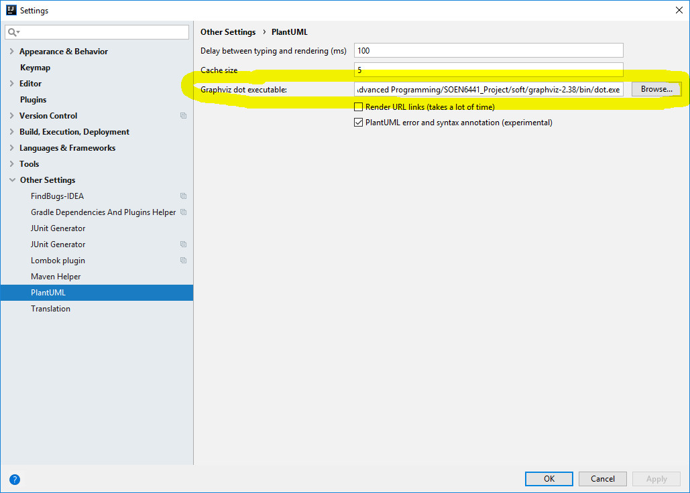
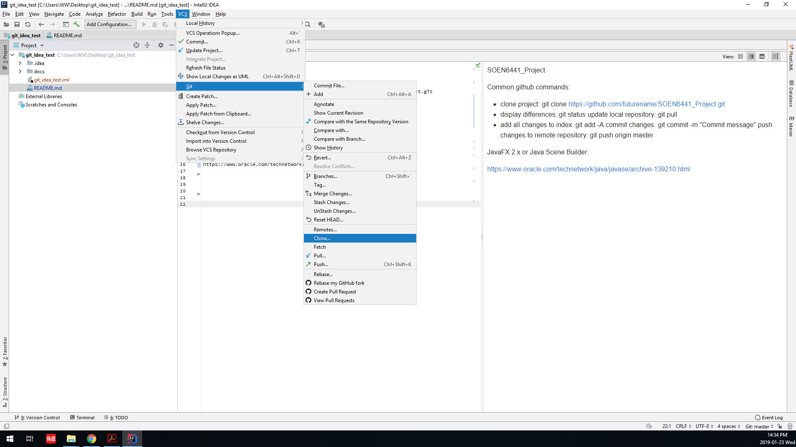
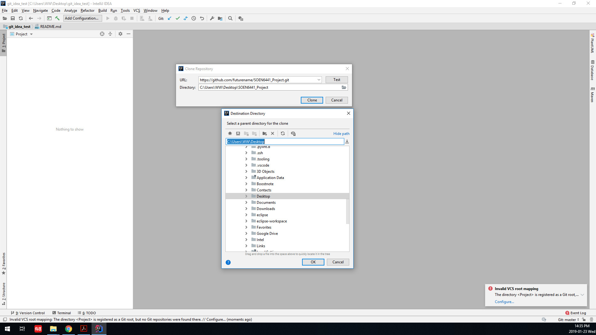
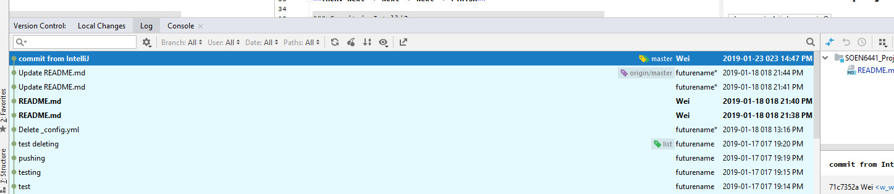

## SOEN6441_Project

[Project]: ProjectDescription.pdf

#### **Common github commands**:

+ clone project:   **git clone https://github.com/futurename/SOEN6441_Project.git **

+ display differences:  **git status**

  update local repository:  **git pull**

+ add all changes to index:  **git add -A**

  commit changes:  **git commit -m "Commit message"**

  push changes to remote repository:  **git push origin master**

+ **Please use JDK8 u151 or above** 

  

+ #### **IntelliJ tips and tricks: https://www.youtube.com/watch?v=eq3KiAH4IBI **

  

+ #### **Java Scene Builder:   ./soft/**

+ #### **plantUML plugin: Intellij -> File -> settings ->plugins -> marketplace -> search "plantUML" -> install -> restart IntelliJ**

+ #### **graphviz:   ./soft/**

  

  

+ #### **Clone and create project in IntelliJ**

#### Commit in IntelliJ:

#### Version control log:

