**Build1**

**Constants put in StartViewController.java**

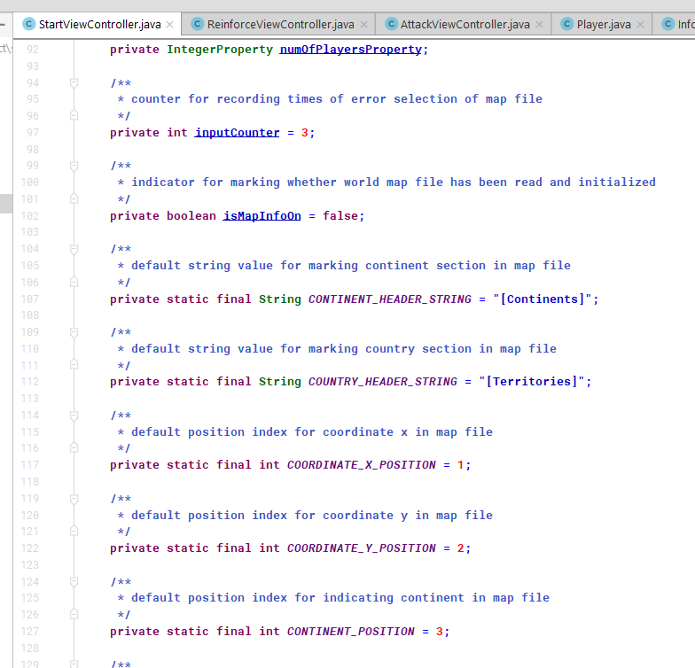

**Build2**

**move to InitWorldMap.java**

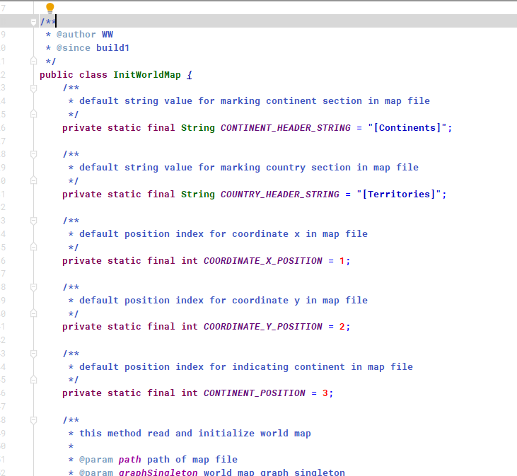

**Build1:**

**initialize map function: in buildWorldMapGraph()**

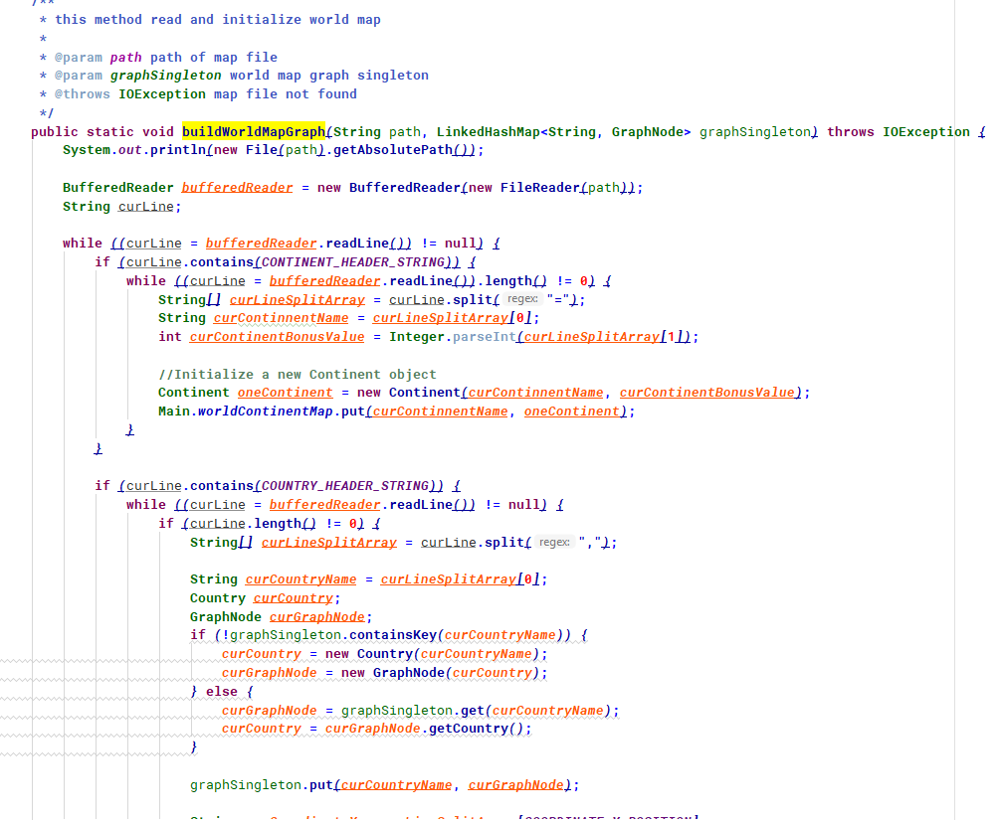

 

**build2:**

**create a new class: InitWorldMap.java**

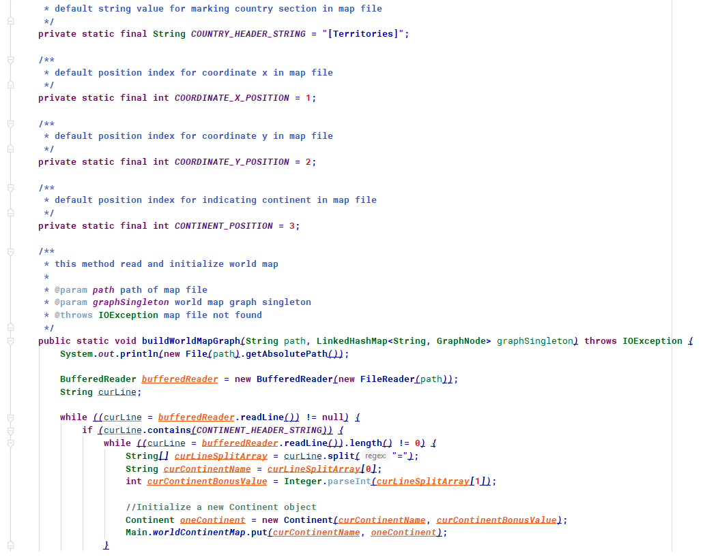

 

**build1:**

**Initialize UI controls inside init method

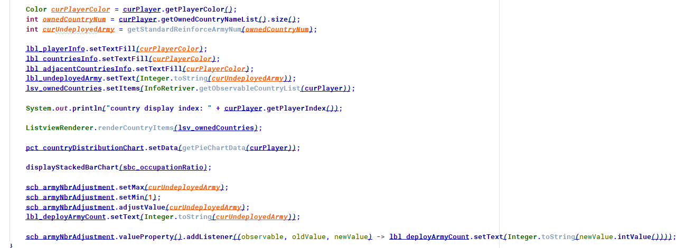

 

 **Build2**

**Exact the codes into a separate method**

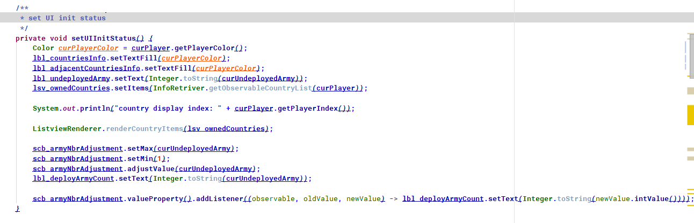

**Build1**

**calculate undeployed army number**

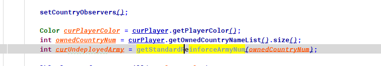

**Build2**

**put it in a new method**

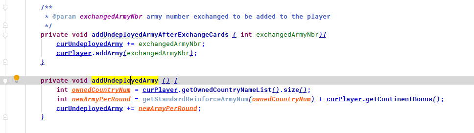

**Build1**

**Alert created inside a method every time needed**

**Build2**

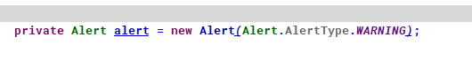

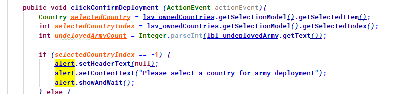

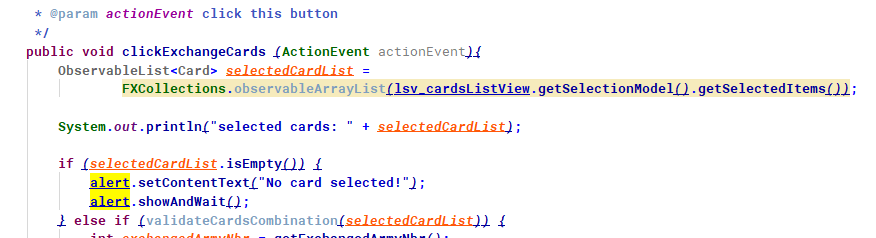

